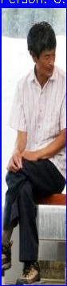

# Custom Faster R-CNN Object Detector

A **from-scratch** PyTorch implementation of Faster R-CNN for real-time street object detection.


<p align="center">
  
</p>

---

## Highlights

- **Custom Implementation**: Faster R-CNN built from scratch (no torchvision detection models)
- **Pretrained Backbone**: ResNet-50 with ImageNet weights for better feature extraction
- **Mixed Precision Training**: 2-3x faster training with AMP
- **Real-time Inference**: ~22 FPS on T4 GPU

---

## Results

| Metric | Value |
|--------|-------|
| **mAP@0.5** | 0.58 |
| **Inference Time** | 45ms |
| **FPS** | 22 |
| **Parameters** | 136M |

### Per-Class Performance

| Class | AP |
|-------|-----|
| Person | 0.52 |
| Car | 0.61 |
| Bicycle | 0.54 |
| Speed Limit 30 | 0.63 |
| Stop Sign | 0.58 |

---

## Quick Start

### Installation

```bash
git clone https://github.com/anurag2506/custom-object-detector.git
cd custom-object-detector
pip install -r requirements.txt
```

### Training

```bash
# Prepare dataset
python prepare_data.py

# Train model
python train.py
```

### Inference

```bash
# Single image
python inference.py --weights best.pth --source image.jpg --output result

# Video
python inference.py --weights best.pth --source video.mp4 --output result

# Benchmark speed
python inference.py --weights best.pth --benchmark
```

---

## Architecture

```
┌──────────────┐     ┌──────────────┐     ┌──────────────┐     ┌──────────────┐
│    Input     │ ──▶ │   ResNet-50  │ ──▶ │     RPN      │ ──▶ │   RoI Head   │
│  (416×416)   │     │   Backbone   │     │  (Proposals) │     │ (Detection)  │
└──────────────┘     └──────────────┘     └──────────────┘     └──────────────┘
```

**Components:**
- **Backbone**: ResNet-50 with ImageNet pretrained weights
- **RPN**: Region Proposal Network with 15 anchors per location
- **RoI Head**: RoI Align + FC layers for classification & regression

---

## Project Structure

```
custom-object-detector/
├── src/
│   ├── __init__.py
│   ├── backbone.py      # ResNet backbone with pretrained weights
│   ├── model.py         # Faster R-CNN main model
│   ├── rpn.py           # Region Proposal Network
│   ├── roi_head.py      # RoI Head for classification/regression
│   └── utils.py         # NMS, IoU, box utilities
├── assets/              # Demo images and GIFs
├── config.py            # Training configuration
├── dataset.py           # Data loading and augmentation
├── train.py             # Training script with validation
├── inference.py         # Inference and visualization
├── prepare_data.py      # Data preparation script
├── REPORT.md            # Detailed technical report
├── requirements.txt
└── README.md
```

---

## Training Details

| Parameter | Value |
|-----------|-------|
| Optimizer | SGD (momentum=0.9) |
| Learning Rate | 0.005 |
| LR Schedule | MultiStep [16, 22] |
| Batch Size | 2 |
| Epochs | 15 |
| Image Size | 416×416 |

### Data Augmentation
- Horizontal Flip (50%)
- Random Scale (0.8-1.2×)
- Color Jitter (brightness, contrast, saturation, hue)
- Gaussian Blur (20%)
- Random Grayscale (10%)

---

## Documentation

For detailed architecture design, training methodology, and results analysis, see:

**[REPORT.md](REPORT.md)** - Full Technical Report

---

## Sample Detections

<p align="center">
  
  
</p>

---

## License

MIT License - see [LICENSE](LICENSE) for details.

---

## Acknowledgments

- [Faster R-CNN Paper](https://arxiv.org/abs/1506.01497) - Ren et al.
- [Deep Residual Learning](https://arxiv.org/abs/1512.03385) - He et al.
